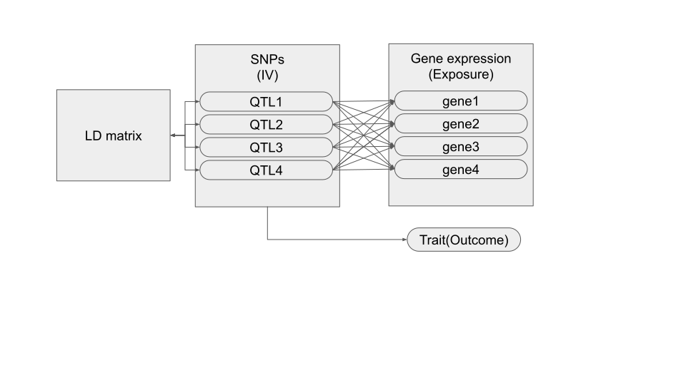

# pyTWMR

Python implementation of [Transcriptome-Wide Mendelian Randomization(TWMR)](https://github.com/eleporcu/TWMR) and [revTWMR](https://github.com/eleporcu/revTWMR) methods by E. Porcu et al. with GPU computation support.

These two Mendelian Randomization methods are modified IVW MR, which account for Linkage Disequilibrium between QTLs(or, with account for correlation between instrumental variables, outside of genetics field).



Methods estimate causal effect of QTLs and genes expression on outcome trait in case of TWMR and causal effect of trait on gene expression in case of revTWMR.

Methods require estimated effect sizes of QTLs on Gene expression(matrix) and on outcome(vector). Additionally, number of QTLs effecting gene expression and total number of samples in QTL-trait GWAS study required for accurate normalization.

- [Installation](#installation)
- [Usage](#usage)

## Installation

With pip:

1. `git clone` this repo into your local folder
2. `pip3 install .` from that folder

OR

`pip3 install git+https://github.com/soreshkov/pyTWMR.git`

## Usage

### As part of Python script

#### TWMR

<details>
<summary> TWMR</summary>

```python
TWMR(beta: Union[np.ndarray, torch.Tensor],  
     gamma: Union[np.ndarray, torch.Tensor],  
     nEQTLs:int,  
     NGwas:int,   
     ldMatrix = None,   
     pseudoInverse = False,   
     device='cpu')
```

    Performs Two-Sample Mendelian Randomization (TWMR) analysis.

    Parameters
    ----------

    beta : Union[np.ndarray, torch.Tensor]
        Matrix of standardized QTL effect sizes for the exposure.
    gamma : Union[np.ndarray, torch.Tensor]
        Vector of QTL effect sizes for the outcome.
    nEQTLs : int
        Number of EQTLs in QTL study.
    NGwas : int
        Number of samples in genome-wide association study.
    ldMatrix : Union[np.ndarray, torch.Tensor], optional
        Linkage disequilibrium matrix. Default is None.
    pseudoInverse : bool, optional
        If True, use Moore-Penrose pseudo-inverse for matrix inversion. Default is False.
    device : str, optional
        Device to use (e.g., 'cpu' or 'cuda'). Default is 'cpu'.

    Returns
    -------
    result: TWMRresult
        Result of TWMR analysis.
        Attributes:
        Alpha : np.ndarray
            Causal effect estimated by TWMR.
        Se : np.ndarray
            Standard error of Alpha.
        Pval : float
            P-value calculated from Alpha and Se.
        D : np.ndarray
            Cohrian Q statistics for QTLs.
        HetP : np.ndarray
            P-value for heterogeneity test.  
</details>

<details>
<summary>QCorrectedTWMR</summary>

```python
QCorrectedTWMR(
        beta: np.ndarray,
        gamma: np.ndarray,
        nEQTLs:int,
        NGwas:int,
        rsnames:Union[np.ndarray, List[str]],
        ldMatrix: Union[np.ndarray, torch.Tensor] = None,
        threshold=0.05,
        pseudoInverse = False, device='cpu')
```
    TWMR method with heterogenity outlier correction. Excludes SNPs by Cohrain Q heterogenity test until SNP heterogenity is no longer observed.

    Parameters
    ----------

    beta : Union[np.ndarray, torch.Tensor]
        Matrix of QTL effect sizes for the exposure.
    gamma : Union[np.ndarray, torch.Tensor]
        Vector of QTL effect sizes for the outcome.
    nEQTLs : Union[np.ndarray, List[str]]
        Number of EQTLs in QTL study.
    NGwas : int
        Number of GWAS (genome-wide association study) samples.
    ldMatrix : Union[np.ndarray, torch.Tensor], optional
        Linkage disequilibrium matrix. Default is None.
    pseudoInverse : bool, optional
        If True, use Moore-Penrose pseudo-inverse for matrix inversion. Default is False.
    device : str, optional
        Device to use (e.g., 'cpu' or 'cuda'). Default is 'cpu'.
        
    Returns
    -------
    result: TWMRresult
        Result of TWMR analysis with outliers removed by iterative Cohrain Q test.
        Attributes:
        Alpha : float
            Causal effect estimated by TWMR.
        Se : float
            Standard error of Alpha.
        Pval : float
            P-value calculated from Alpha and Se.
        D : float
            Cohrian Q statistics for Alphas.
        HetP : float
            P-value for heterogeneity test.   
    rsnames: List[str]
        List of QTLs after removing outliers.


</details>

#### revTWMR

<details>
<summary>revTWMR</summary>

```python
revTWMR(
        qtlExposureEffects :Union[np.ndarray, torch.Tensor], 
        qtlTraitGWASEffects:Union[np.ndarray, torch.Tensor], 
        qtlLabels:Union[np.ndarray, List[str]], 
        gwasSizes:Union[np.ndarray, torch.Tensor], 
        qtlExpSize:float, 
        pValIterativeThreshold:float = 0.05,
        pseudoInverse = False, 
        device='cpu')
```
    revTWMR method for Mendelian Randomization anylysis. 
    Analyses the causal effect of trait(outcome) on gene expression(exposure) derived from GWAS and eQTL data.
    
    Parameters
    ----------
        qtlExposureEffect : Union[np.ndarray, torch.Tensor]
            Vector of standardized effect sizes trans-QTLs effect on gene expression, shape (QTLs,) 
        qtlTraitGWASEffects :  Union[np.ndarray, torch.Tensor]
            Vector of standardized effect sizes of independent SNPs on trait, shape (QTLs,)
        qtlLabels : Union[np.ndarray, List[str]]
            QTL name labels, shape (QTLs,)
        gwasSizes : Union[np.ndarray, torch.Tensor]
            GWAS sample size, shape (QTLs,)
        qtlExpSize : float
            QTL Exposure sample size, number
        pValIterativeThreshold : float, optional
            Threshold to exclude pleyotropic QTLs. Defaults to 0.05.
        pseudoInverse : bool, optional
            Forces Moore-Penrose pseudoinverse instead of default inverse matrix operation. Defaults to False.
        device : str, optional 
            Device to use for computations. Could be 'cpu' or 'cuda' if CUDA is available. Defaults to 'cpu'.

    Returns
    -------
        result: revTWMRResult
            Named tuple containing attributes:
            Alpha : float
                Causal effect estimated by revTWMR before applying heterogeneity test
            Se : float
                Standard error of Alpha
            Pval : float
                Pvalue calculated from Alpha and Se
            N : float
                number of SNPs used as instruments 
            HetP : float
                Original P-value for heterogeneity test
            AlphaIterative : float
                Causal effect estimated by revTWMR after removing the SNPs detected as outliers by the heterogenity test
            SeIterative : float
                standard error of AlphaIterative
            PvalIterative : float
                Pvalue calculated from AlphaIterative and SeIterative
            HetPIterative : float
                Pvalue of heterogenity test after outlier removal
            rsname : List[str]
                SNPs left after outlier removal   
</details>

Also, see [demo.ipynb](https://github.com/soreshkov/pyTWMR/blob/master/demo/demo.ipynb) for usage example.

### As console app

After installation it is possible to use package as console application.

For TWMR command would be:

`pyTWMR [-h] --effect EFFECT --ld LD --nEQTLs NEQTLS --nGWAS NGWAS  [--removeOutliers] [--pseudoInverse PSEUDOINVERSE] [--device DEVICE] --output OUTPUT`

Where:

- `effect` - path to TSV file containing the beta matrix of effect sizes of SNPs on gene expression. For example of such file see `demo/TWMR/ENSG00000000419.matrix`

- `ld`- path to the file containing the LD matrix with correlation coefficients between SNPs. For example of such file see `demo/TWMR/ENSG00000000419.ld`
- `nEQTLs` -  number of samples in the eQTL study used to estimate SNP effects on gene expression
- `nGWAS` - number of samples in the GWAS used to estimate SNP effects on trait
- `removeOutliers` - Iteratively removes heterogenious outliers if this option is present
- `output` - Path to output file

Method creates TSV file with following columns:

- `Gene` - Gene labels from input table columns
- `Alpha` - Causal effect estimation for each gene
- `Standard error` - Standard error estimation for each causal effect
- `P-value` - P-value computed from corresponding `Alpha` and `Standard error`
- `Heterogenity P-value` - P-value for heterogenity test

---

Command for RevTWMR:

`pyRevTWMR [-h] --effect EFFECT [--ld LD] --sampleSize SAMPLESIZE [--hetThreshold HETTHRESHOLD] [--pseudoInverse PSEUDOINVERSE] [--device DEVICE] --output OUTPUT`

- `effect` - path to the tab-separated file containing the standardized QTLs effect sizes for genes and GWAS. For example of such file see `demo/revTWMR/effect.matrix.tsv`
- `sampleSize` -  path to the tab-separated file containing the standardized sample size for QTL study. For example of such file see `demo/revTWMR/genes.N.tsv`
- `ld` -   path to the file containing the LD matrix with correlation coefficients between QTLs
- `hetThreshold` - P-value threshold for heterogenity test
- `output` -  path to output file

---
Common arguments are:  

- `pseudoInverse` - Uses Moore-Penrose pseudo-inverse instead of basic inverse matrix operation if present
- `device` - could be `cpu` or `cuda`. If there is CUDA compute capability, package will try to use it for computations

Method creates TSV file with following columns:

- `Gene` - Gene labels from input table columns
- `Alpha Original`- Causal effect estimation for each gene
- `SE Original` - Standard error estimation for each causal effect
- `P Value Original` - P-value computed from corresponding `Alpha` and `Standard error`
- `N Original` - Number of QTLs used to estimate causal effect
- `P heterogeneity Original` - P-value for heterogenity test
- `Alpha` - Causal effect estimation for each gene after heterogenius outlier removed
- `SE` - Standard error estimation for each causal effect  after heterogenius outlier removed
- `P` - P-value computed from corresponding `Alpha` and `Standard error` after heterogenius outlier removed
- `P heterogeneity` - P-value for heterogenity test after heterogenius outlier removed
- `N` - Number of QTLs used to estimate causal effect after heterogenius outlier removed

If no heterogenity is detected, then values for gene before and after outlier removal will match.

### Unit tests

We provide basic unit-tests to ensure codebase stability.

Tests could be run as simple script:
`python3 tests/tests.py`